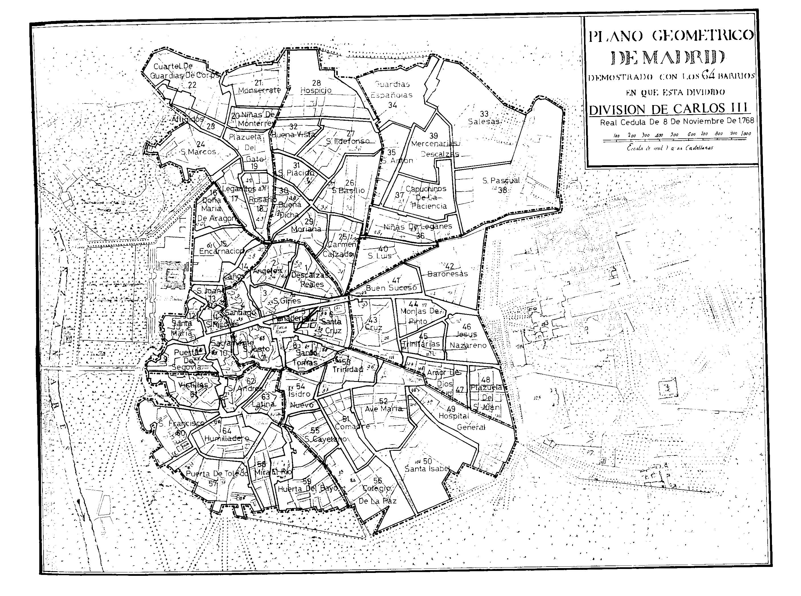

# carcem_arcgis
_English version below_

Este repositorio es parte del proyecto [CARCEM](https://dimh.hypotheses.org/equipo), aquí se encuentra parte de los datos espaciales que se han utilizado además del código Python para interactuar con ArcGIS Online.

# CARCEM - Cartografías de la ciudad en la Edad Moderna

Esta investigación se ha desarrollado en el marco del proyecto I+D+i "Cartografías de la ciudad en la Edad Moderna: relatos, imágenes, representaciones" (PID2020-113380GB-I00 / AEI / 10.13039/501100011033), financiado por la Agencia Estatal de Investigación (Ministeriode Ciencia e Innovación).

Estudiar las cartografías de la ciudad en la Edad Moderna es una invitación a plantear nuevas preguntas de investigación centradas en su dimensión espacial desde una mirada poliédrica, desde aquello que atañe a las distintas formas de concebir, idear y proyectar los espacios urbanos a las maneras con las que se describen, narran y representan, o los modos de usarlos, transitarlos y habitarlos.

Studying the cartographies of the city in the Modern Age is an invitation to pose new research questions centred on the spatial dimension. We work from a polyhedral viewpoint, which involves the different ways of conceiving, devising and projecting urban spaces using how they are described, narrated and represented, and how cities are used, passed through and inhabited.

